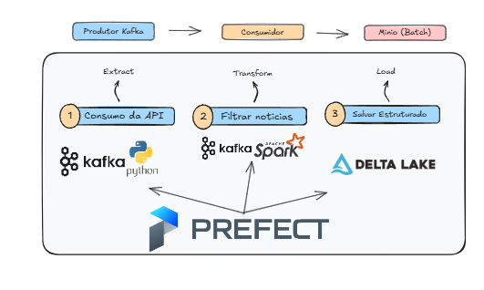

# monitoramento-genomica
# monitoramento-genomica

# Sistema de Monitoramento de Avanços no Campo da Genômica

## Descrição do Projeto

Este projeto foi desenvolvido simulando um time de engenharia de dados da empresa ficticia HealthGen, uma empresa especializada em genômica e medicina personalizada. A genômica, que estuda o conjunto completo de genes de um organismo, desempenha um papel crucial na pesquisa biomédica e medicina personalizada, permitindo a identificação de variantes genéticas e mutações associadas a doenças, além de facilitar tratamentos com base nas características genéticas dos pacientes.

O objetivo principal deste projeto foi criar um sistema que coleta, analisa e apresenta as últimas notícias relacionadas ao campo da genômica e medicina personalizada, permitindo à empresa se manter atualizada com os avanços recentes, identificar novas oportunidades de pesquisa e otimizar suas estratégias de desenvolvimento.

## Funcionalidades do Sistema

O sistema foi desenhado para executar várias atividades essenciais:

1. **Consumo de dados com a News API:**
   - Utilizamos a News API (https://newsapi.org/) para buscar notícias de fontes confiáveis e especializadas sobre genômica e medicina personalizada.
   - O sistema extrai notícias relevantes que abordam temas como sequenciamento de DNA, terapias genéticas personalizadas e descobertas sobre doenças genéticas específicas.

2. **Definição de Critérios de Relevância:**
   - Implementamos filtros para garantir que apenas notícias com impacto significativo sobre o campo sejam consideradas. Essas notícias incluem palavras-chave relacionadas a genômica, sequenciamento de DNA, terapias genéticas e doenças específicas.
   - As palavras escolhidas foram: **Filogenética, Metagenômica, Genes, DNA**

3. **Cargas em Batches:**
   - As notícias relevantes são armazenadas em um banco de dados, onde realizamos a carga em batches a cada hora.
   - O processo evita a duplicação de dados, garantindo que uma notícia não seja armazenada mais de uma vez.

4. **Transformação de Dados para Consulta Pública:**
   - Aplicamos transformações diárias nos dados, permitindo consultas avançadas com base nos seguintes critérios:
     - Quantidade de notícias por ano, mês e dia de publicação.
     - Quantidade de notícias por fonte e autor.
     - Quantidade de aparições de palavras-chave relevantes por ano, mês e dia.

5. **Eventos em Tempo Real:**
   O sistema também oferece a capacidade de lidar com dados em tempo real, por meio de duas opções:

   - **Opção 1 - Apache Kafka e Spark Streaming:**
     - Implementamos um pipeline de dados usando Apache Kafka e Spark Streaming, capaz de consumir eventos em tempo real e armazenar dados temporariamente para uma verificação paralela.
     - Após a verificação, os dados são inseridos no destino principal de armazenamento, evitando duplicações.

   - **Opção 2 - Webhooks com Notificações por Eventos:**
     - Configuramos um webhook para receber dados a partir de um evento representado por uma requisição POST. As notícias adquiridas por esse método são armazenadas temporariamente e verificadas antes de serem inseridas no destino final, evitando dados duplicados.

## Arquitetura escolhida

